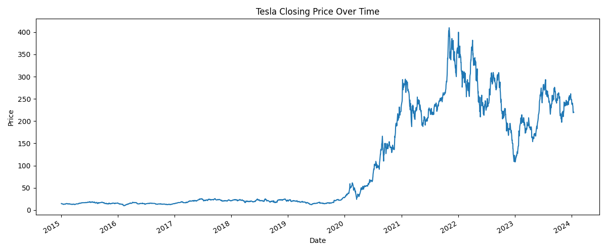

# 📊 Exploratory Data Analysis (EDA)

This section presents visual and statistical analysis of Tesla’s historical stock behavior to inform model development.

---

## 1. 📈 Tesla Closing Price Over Time
  
**Interpretation**: Tesla’s stock price exhibits exponential growth from late 2019 to 2022, followed by high volatility. This trend reflects investor enthusiasm and market dynamics.

---

## 2. 🔁 Daily Returns Over Time
  
**Interpretation**: Returns are centered around zero with spikes during major events (e.g., 2020 pandemic). Modeling returns captures short-term fluctuations and risk.

---

## 3. 📉 20-Day Rolling Volatility
  
**Interpretation**: Volatility surged during 2020 and 2022, aligning with market uncertainty. Rolling volatility helps evaluate changing risk.

---

## 4. 🧪 Outlier Detection via Boxplots

**Returns**:  
  

**Volume**:  
  

**Interpretation**: Outliers in returns and volume highlight extreme events. These may influence model sensitivity and require preprocessing.

---

## 5. 📊 Descriptive Statistics

| Feature           | Mean       | Skewness | Kurtosis |
|------------------|------------|----------|----------|
| Return            | 0.0018     | 0.179    | 4.34     |
| Log Return        | 0.0012     | -0.159   | 4.52     |
| Rolling Std (20)  | 6.73       | 1.69     | 2.94     |
| Volume            | 1.14e+08   | 2.74     | 13.33    |

**Interpretation**: Non-normal behavior in volume (high kurtosis, skewness) suggests episodic surges in trading activity.

## 6. 🔗 Correlation Matrix
  
**Interpretation**: Strong correlation between lag and rolling features confirms temporal structure. Weak correlation between volume and return aligns with financial theory.

---

## 7. 🔄 ACF and PACF of Returns

**ACF**:  
  

**PACF**:  
  

**Interpretation**: Lag 1 exhibits weak autocorrelation. Higher-order lags contribute little, supporting simpler AR/MA models.

---

## 8. 📉 STL Decomposition

**Trend**:  
  

**Seasonal**:  
  

**Residual**:  
  

**Interpretation**: A strong upward trend and mild seasonality are present. Residuals highlight irregular fluctuations for model calibration.

---
