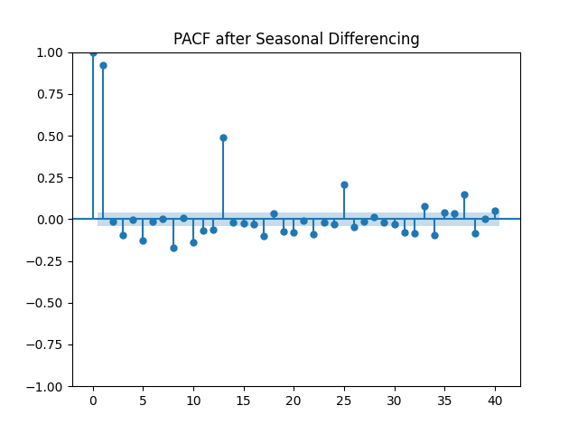
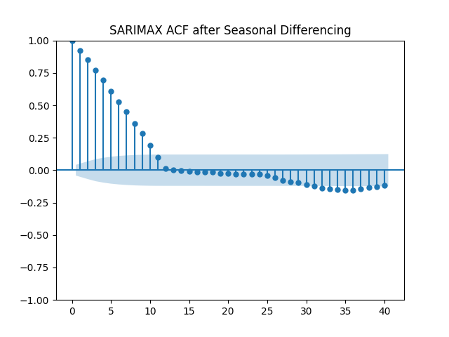
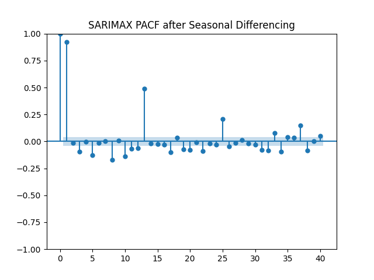
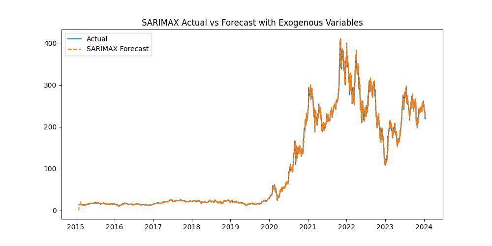

## 🌀 SARIMA Model Summary

We applied a **SARIMA(1,1,1)(1,1,1,12)** model to capture both short-term trends and seasonal effects in Tesla's stock price.

**Evaluation Metrics:**
- AIC: 14,368.07
- BIC: 14,396.68
- Log Likelihood: -7,179.03

**Diagnostics:**
- Ljung-Box Q (lag 1): 1.70 (p ≈ 0.19) → residuals uncorrelated
- Jarque-Bera: 13,169.58 (p < 0.001) → residuals not normally distributed
- Heteroskedasticity: Present (H = 542.62)
- Skewness: -0.24  
- Kurtosis: 14.81

**Figures:**
- 
- 
- 

**Interpretation**:  
SARIMA captures seasonal dynamics well and outperforms ARIMA in modeling regular patterns. However, residuals still show heavy tails.

---

## 🔁 SARIMAX Model with Exogenous Variables

We enhanced the SARIMA model by including exogenous predictors: **Lagged Returns** and **Volume**.

**Model: SARIMAX(1,1,1)(1,1,1,12) + [Return_lag1, Volume]**

**Key Coefficients:**
- `Return_lag1`: -5.3102 (p < 0.001) → significant
- `Volume`: 4.92e-09 (p ≈ 0.17) → not statistically significant

**Metrics:**
- AIC: 14,830.46
- BIC: 14,870.47
- Log Likelihood: -7,408.23

**Figures:**
- 
- 
- 

**Interpretation**:  
Adding lagged returns significantly improves explanatory power. SARIMAX is promising for capturing both internal and external drivers of price movement.