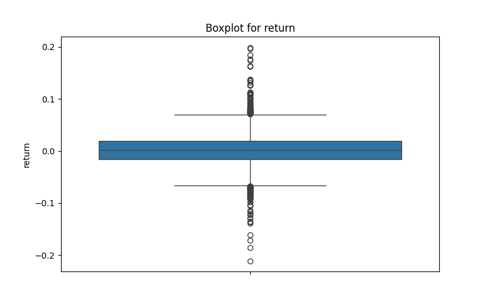
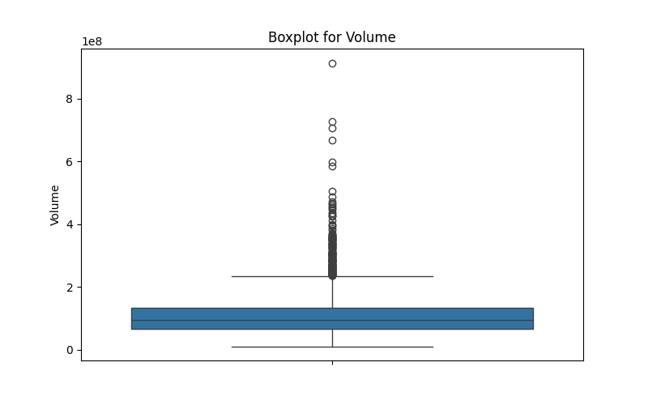

## 📦 Outlier Detection Boxplots

The following boxplots help visualize potential outliers in Tesla stock data:

### 🔹 Return Distribution

This boxplot visualizes the daily return distribution of Tesla stock.  
Most returns cluster tightly around zero, indicating overall price stability on a day-to-day basis.  
However, there are several significant outliers both above and below, representing days of unusual gains or losses, likely due to earnings announcements or market shocks.

### 🔹 Volume Distribution

The boxplot for trading volume shows a wide range with a heavy upper tail.  
This indicates that while most days have moderate trading activity, there are several high-volume outliers, which may coincide with news events, quarterly earnings releases, or broader market moves.  
Such spikes in volume often reflect investor reactions to new information or speculation.

### ARIMA Model Evaluation Summary

We fit an ARIMA(1,1,1) model to Tesla's closing stock prices. Key evaluation metrics:

- AIC: 14,763.84
- BIC: 14,781.14
- Log Likelihood: -7,378.92
- RMSE: ~5.53 (computed from predictions)
- Residual Diagnostics:
  - Ljung-Box Q (lag 1): 0.43 (p ≈ 0.51) → residuals uncorrelated
  - Jarque-Bera: 15,947.58 (p < 0.001) → residuals not normally distributed
  - Heteroskedasticity: Strong presence (H = 539.95)
  - Skewness: -0.10
  - Kurtosis: 15.74 (leptokurtic)

Overall, ARIMA(1,1,1) captures short-term dynamics but residuals indicate volatility clustering and heavy tails. Suitable for baseline forecasting.
